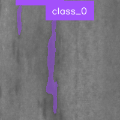

# RF-DETR Segmentation Training and Inference Guide

[繁體中文說明](./README_ZHTW.md)

This project uses `main.py` to:

1. Convert YOLO segmentation labels to COCO segmentation format  
2. Train an RF-DETR segmentation model (default: 50 epochs)  
3. Run batch inference and save annotated output images

## Demo Prediction Result



---

## 1. Project Structure

- `main.py`: main pipeline (train + inference)
- `requirements.txt`: flexible dependency install
- `requirements-lock.txt`: pinned versions for reproducibility
- `sdsaliency900/sdsaliency900_dataset`: training dataset (YOLO segmentation)
- `sdsaliency900/dataset_predict`: inference input images
- `sdsaliency900/rfdetr_coco_dataset`: auto-generated COCO dataset
- `sdsaliency900/rfdetr_train_output`: training outputs (weights/logs)
- `sdsaliency900/predict_results`: inference output images

---

## 2. Environment Setup

Recommended environment: `initpy312` (conda).

### Option A: Standard install

```bash
pip install -r requirements.txt
```

### Option B: Pinned install (recommended)

```bash
pip install -r requirements-lock.txt
```

---

## 3. How To Run

### 3.1 Train then infer (default workflow)

```bash
python main.py --mode train_predict
```

This will:
- convert YOLO segmentation to COCO format
- train RF-DETR segmentation model (50 epochs by default)
- run batch inference on `dataset_predict`

### 3.2 Model size selection (default: `nano`)

```bash
python main.py --mode train_predict --model-size nano
python main.py --mode train_predict --model-size small
python main.py --mode train_predict --model-size medium
```

Notes:
- default is `nano` (recommended for 4GB VRAM GPUs such as T400)
- `medium` is more likely to run out of memory on low-VRAM GPUs

### 3.3 Inference only (skip training)

```bash
python main.py --mode predict_only
```

This mode:
- tries to use the latest trained weight in `rfdetr_train_output`
- falls back to official pretrained weights if none are found

### 3.4 Inference with a specific weight file

```bash
python main.py --mode predict_only --predict-weights "F:/detr/sdsaliency900/rfdetr_train_output/your_model.pt"
```

### 3.5 Set confidence threshold

```bash
python main.py --mode predict_only --threshold 0.5
```

### 3.6 Training epochs (default: 50)

```bash
python main.py --mode train_predict --epochs 30
```

### 3.7 Recommended command on 4GB VRAM

```bash
python main.py --mode train_predict --model-size nano --epochs 50
```

---

## 4. Input Dataset Format

YOLO segmentation layout:

- images: `images/train/*.png`, `images/val/*.png`
- labels: `labels/train/*.txt`, `labels/val/*.txt`
- label line format: `class x1 y1 x2 y2 ...` (normalized coordinates in `[0,1]`)

The script automatically:
- exports COCO annotations as `_annotations.coco.json`
- maps validation split to RF-DETR expected `valid`
- resizes training images to a model-safe size divisible by backbone constraints

---

## 5. Troubleshooting

### Missing `pytorch_lightning`

```bash
pip install pytorch-lightning
```

### Missing `pycocotools`

```bash
pip install pycocotools
```

### Missing `faster-coco-eval`

```bash
pip install faster-coco-eval
```

### TensorBoard logging warning

```bash
pip install tensorboard
```

### CUDA out of memory (`RuntimeError: CUDA error: out of memory`)

- use `--model-size nano`
- keep `batch_size=1` (already set in `main.py`)
- close other GPU-heavy apps before training

### Input type and weight type mismatch during inference
(`Input type (torch.cuda.FloatTensor) and weight type (torch.FloatTensor)`)

- this was caused by model weights on CPU after training teardown
- current `main.py` already moves model weights back to the inference device before `predict()`

### `TypeError: a bytes-like object is required, not 'Image'` when saving prediction

- `supervision` annotators may return either PIL image or numpy array
- current `main.py` already handles both output types when saving images

### Interrupted pretrained weight download (`ChunkedEncodingError`)

- rerun `python main.py`
- retry logic is already built into `main.py`

---

## 6. Notes

- first run downloads pretrained weights for the selected model size
- CUDA GPU is strongly recommended for training speed
- use `predict_only` for fast repeated inference without retraining
